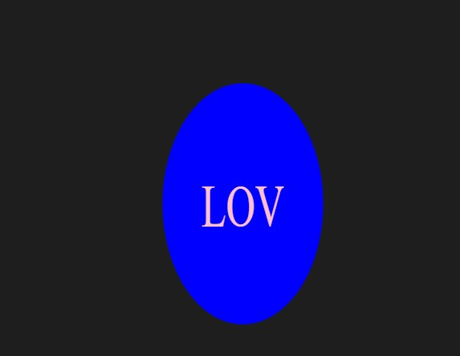

# SVG Logo Maker

## Table of Contents
- [Description](#description)
- [YouTube Link](#youtube-link)
- [GitHub Repository](#github-respository)
- [User Story](#user-story)
- [Acceptance Criteria](#acceptance-criteria)
- [Screenshots](#screenshots)
- [Technologies Used](#technologies-used)
- [Installation](#installation)
- [Helpful Information](#helpful-information)
- [Test Instructions](#test-instructions)

## Description

My motivation for this project was to be able to create logos without having to hire a graphic designer. Why I built this project was because It provided an opportunity for me to explore new technologies, libraries, and concepts related to generating SVG files. The problems I solved was implement unit testing for the first time. I created a test suite comprising three tests, which verify the accuracy of the generated shapes and colors.What I learned was how to develop an application that utilizes the inquirer library to prompt users for their logo preferences, which users can specify up to three characters of text, select a text color, and choose a shape (triangle, square, or circle) along with its corresponding color. 


## YouTube Link
https://youtu.be/uO4tILVFL9c

## GitHub Respository
https://github.com/karafaris/SVGLogoGenerator.git

### User Story
```md
AS a freelance web developer
I WANT to generate a simple logo for my projects
SO THAT I don't have to pay a graphic designer
```

## Acceptance Criteria
```md
GIVEN a command-line application that accepts user input
WHEN I am prompted for text
THEN I can enter up to three characters
WHEN I am prompted for the text color
THEN I can enter a color keyword (OR a hexadecimal number)
WHEN I am prompted for a shape
THEN I am presented with a list of shapes to choose from: circle, triangle, and square
WHEN I am prompted for the shape's color
THEN I can enter a color keyword (OR a hexadecimal number)
WHEN I have entered input for all the prompts
THEN an SVG file is created named `logo.svg`
AND the output text "Generated logo.svg" is printed in the command line
WHEN I open the `logo.svg` file in a browser
THEN I am shown a 300x200 pixel image that matches the criteria I entered
```

## Screenshots


### Example Logos



## Technologies Used
This project utilizes Node.js v16, inquirer v8.2.4 (node package manager), and file system module (node package manager), as well as jest v29.5.0 (node package manager) for conducting unit testing.

## Installation
Clone the repository https://github.com/karafaris/SVGLogoGenerator.git

Using the terminal, run "npm i" to install the application's dependencies. For inquirer and jest, developers can install them directly from the command line using "npm i inquirer@8.2.4" for version 8.2.4 of inquirer and "npm i jest" for the latest version of jest. 6. Type "node index.js" in the terminal to run the application.

## Helpful Information
To run the application, navigate to its directory using the command line, install dependencies (npm i), and run the command "node index.js". Answer the questions that follow and once done, a message will appear confirming the logo generation. Check the newly generated SVG file for your new logo.

## Test Instructions
To perform unit testing, execute the command "npm run test" in the terminal. Currently, there is a single test suite containing three tests. This suite verifies that the render() method generates the correct string for the specified shape color in the associated SVG file.

